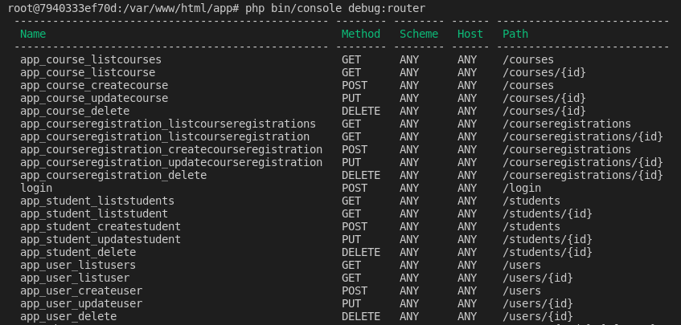

# Subindo o ambiente da aplicação

Dentro do diretório raiz execute o seguinte comando:

```
make environment
```

Ele irá criar a imagem necessária e subir os containers da aplicação.
Se tudo correr bem o adminer estará em execução em [Adminer](http://localhost:8080) e a api estará em execução em [api](http://localhost:8090/app/public/index.php)

# Configurando aplicação

Execute o comando ``` make container ``` para entrar no container da aplicação.

Dentro do container da aplicacao execute ``` make up ```. Ele irá baixar a dependências do projeto, gerar e executar o arquivo de migration para criar as tabelas do banco de dados e popular com dados fictícios.

**Obs: Nesse processo você precisará confirmar algumas solicitações para que possam ser executadas as migrations e o banco de dados seja populado com dados fictícios** 


# Executando testes unitários

Acesse o container da aplicação com ```make container``` e execute ```make test```

# Collection Postman

No diretório raiz na pasta ```docs``` tem um arquivo de collections ```API.postman_collection``` para utilização da api.

Basta que seja importada no postman e terá acesso as seguintes rotas:



Usuário para testar


Será gerado um token de acesso

Toda requisição exceto ```/login``` será necessário incluir no header

``` Authorization: Bearer $token ```


# Adminer


Para acessar informe os seguintes dados:
- **Servidor**: app-mysql
- **Usuário:** root
- **Senha:** root
- **Base de dados:** api

# Help

Caso tenha algum problema em subir o ambiente tente limpar os container e imagens do docker

Alguns comandos podem te auxiliar

``` 
docker stop $(docker ps -aq)

docker rm $(docker ps -aq)

docker rmi $(docker images -q) --force
```

Lembre sempre de remover a pasta ``` ./docker ``` antes de subir o ambiente. Ela contém o volume do mysql, isso pode causar algum problema de permissão na hora de fazer o build.

Lembre sempre de remover todas as migrations em ``` ./app/migrations ``` antes de tentar subir o ambiente.